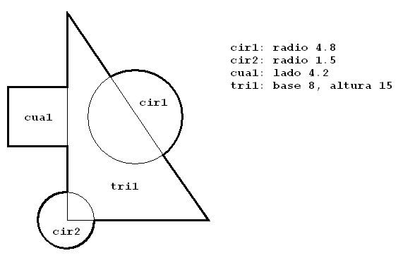

##### *Desarrollo Web en Entorno Servidor - Curso 2017/2018 - IES Leonardo Da Vinci - Alberto Ruiz*
## U0P05 - Figuras
#### Entrega de: *pon aquí tu nombre*
----

#### 1. Descripción:

Vamos a utilizar el enfoque orientado a objetos para solucionar un problema trigonométrico, repasando conceptos como clases y objetos, herencia y polimorfismo, colecciones, o JavaDoc.

#### 2. Formato de entrega:

Incluye al final de este documento el código de las clases que hayas programado, así como el resultado de ejecución.

Puedes utilizar bloques de código Markdown o capturas de Eclipse.

#### 3. Trabajo a realizar:

#### Parte 1: Clases y objetos

Crea un paquete llamado `figuras` y codifica las clases Cuadrado, Triangulo y Circunferencia. Incluye en todas un método para imprimir sus datos. Después codifica una clase *Problema* que calcule el área y el perímetro de la siguiente figura:



##### Código de la clase Cuadrado:

```java
System.out.println("Ejemplo de bloque de código");
```

##### Código de la clase Triángulo:

##### Código de la clase Circunferencia:

##### Código del método main en la clase Problema:

##### Ejecución del método main:

#### Parte 2: Herencia

Queremos que todas las figuras tengan un título y un color. Para el color puedes utilizar un tipo enumerado Color con al menos cinco valores.

1. Define una clase Figura con estos nuevos atributos
- Haz que nuestras clases de figuras hereden dichos atributos
- ¿Crees que la clase Figura debería ser abstracta? ¿Y los métodos de calcular áreas y perímetros? Si es así haz las modificaciones necesarias
- Utilizando la *reescritura*, haz que de cada figura se impriman en pantalla tanto sus atributos heredados (color y título) como los propios de esa figura particular.
- Crea una clase Principal con un método main en el que instancies diferentes figuras por este procedimiento y escribas sus datos por pantalla.

##### Código de la clase Figura:

##### Código de la clase Cuadrado una vez modificada:

##### Código del método main en la clase Principal:

##### Ejecución del método main:

#### Parte 3: Colecciones

1. Codifica una clase GestorFiguras con un único atributo (un ArrayList de figuras) y los siguientes métodos, teniendo cuidado de documentar con código JavaDoc:
  - **constructor**: no recibirá ningún valor pero inicializará el ArrayList
  - **añadirFigura**: recibirá un objeto de la clase Figura y lo añadirá a la lista siempre que no tenga el mismo título
  - **eliminarFigura**: eliminará una figura a partir de su título
  - **mostrarFiguras**: escribirá por pantalla de forma ordenada los datos de todas las figuras del gestor
  - **calcularSumatorioAreas**: escribirá la suma de las áreas de todas las figuras

2. Modifica el método main de la clase Principal para crear un gestor de figuras y hacer pruebas con él: añadir alguna, eliminarla, imprimirlas... 

##### Código de la clase GestorFiguras:

##### Código del método main en la clase Principal:

##### Ejecución del método main:
