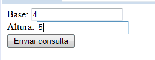
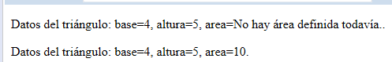
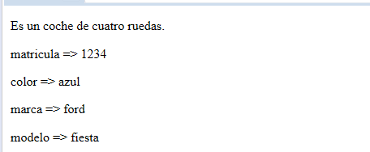

###### *Desarrollo Web en Entorno Servidor - Curso 2017/2018 - IES Leonardo Da Vinci - Alberto Ruiz*
## U2P04 - Clases y objetos
#### Entrega de: *Pedro Plaza Ramos*
----
#### 1. Descripción:

Practica sencilla para trabajar con clases y objetos en PHP.

#### 2. Formato de entrega:

Un documento en el que se incluya el codigo fuente del archivo o archivos generados, así como una captura de pantalla de una ejecución.

#### 3. Trabajo a realizar:

Realiza una aplicación web que recoja en un formulario unos datos y los utilice para crear un objeto de una clase, llamar a uno de sus metodos, y mostrar el resultado por pantalla.

Ejemplo basado en la documentacion:

1. Mostrar un formulario con dos campos para introducir la base y la altura de un triángulo
2. Instanciar un objeto de la clase Triangulo
3. Invocar el método *calcularArea*
4. Mostrar el resultado cuidando la presentación

Triangulo:
```PHP
<!doctype html>
<html>
<head>
	<title>Objetos</title>
	<meta charset="UTF-8"/>
	<meta name="author" content="Pedro Plaza Ramos"/>
</head>
<body>
<?php
include("clases.php");
if(!isset($_POST["enviar"])){
?>
	<form action="<?php echo htmlspecialchars($_SERVER["PHP_SELF"], ENT_QUOTES, "UTF-8");?>" method="post">
	Base: <input type="number" name="base" required>
	<br/>
	Altura: <input type="number" name="altura" required>
	<br/>
	<input type="submit" name ="enviar">
	</form>
	<?php
} else {
    $base=$_POST["base"];
    $altura=$_POST["altura"];
    $triangulo=new Triangulo($base, $altura);
    echo $triangulo;
    echo $triangulo->calcularArea();
    echo $triangulo;

}
?>
</body>
</html>
```
Clases:
```PHP
<?php
class Triangulo{
    private $base=0;
    private $altura=0;
    private $area="No hay área definida todavía.";

    public function __construct($base, $altura){
           $this->base=$base;
           $this->altura=$altura;
    }

    public function __toString(){
        return "<p>Datos del triángulo: base=".$this->base.", altura=".$this->altura.", area=".$this->area.".</p>";
    }

    public function calcularArea(){
        $this->area=$this->base*$this->altura/2;
    }

}
?>
```
Resultado:




Se pide pensar en un ejemplo diferente a este, de igual o mayor complejidad.

Si te sobra tiempo y lo deseas puedes investigar e incorporar a tu actividad otros elementos de programación orientada a objetos en PHP, como:

 * [La herencia](http://php.net/manual/es/language.oop5.inheritance.php "")
 * [La impresion de todos los atributos de un objeto utilizando *foreach*](http://php.net/manual/es/language.oop5.iterations.php "")
 * [Las referencias a objetos](http://php.net/manual/es/language.oop5.references.php "")

Vehiculos:
```PHP
<!doctype html>
<html>
<head>
	<title>Objetos</title>
	<meta charset="UTF-8"/>
	<meta name="author" content="Pedro Plaza Ramos"/>
</head>
<body>
<?php
include("clases.php");
if(!isset($_POST["enviar"])){
?>
	<form action="<?php echo htmlspecialchars($_SERVER["PHP_SELF"], ENT_QUOTES, "UTF-8");?>" method="post">
	Matricula: <input type="text" name="matricula" required>
	<br/>
	Color: <input type="text" name="color" required>
	<br/>
	Marca: <input type="text" name="marca" required>
	<br/>
	Modelo: <input type="text" name="modelo" required>
	<br/>
	<input type="submit" name ="enviar">
	</form>
	<?php
} else {
    $matricula=$_POST["matricula"];
    $color=$_POST["color"];
    $marca=$_POST["marca"];
    $modelo=$_POST["modelo"];
    $vehiculo=new Coche($matricula, $color, $marca, $modelo);
    echo $vehiculo;

}
?>
</body>
</html>
```

Clases:

```PHP
<?php
class Vehiculo{
    private $matricula;
    private $color;
    private $marca;
    private $modelo;

    public function __construct($matricula, $color, $marca, $modelo){
        $this->matricula=$matricula;
        $this->color=$color;
        $this->marca=$marca;
        $this->modelo=$modelo;
    }

    public function __toString(){
        foreach($this as $clave => $valor){
            echo "<p>$clave => $valor</p>";
        }
    }

}

class Coche extends Vehiculo{
    private $ruedas=4;

    public function __construct($matricula, $color, $marca, $modelo){
        parent::__construct($matricula, $color, $marca, $modelo);
    }

    public function __toString(){
        echo "<p>Es un coche de cuatro ruedas.</p>";
        parent::__toString();
    }
}

?>
```

Resultado:



