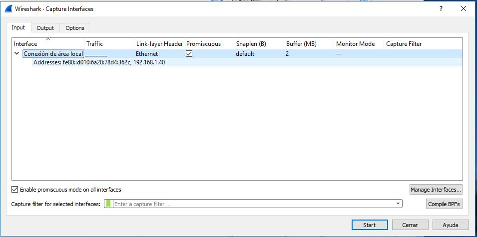
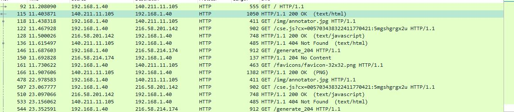
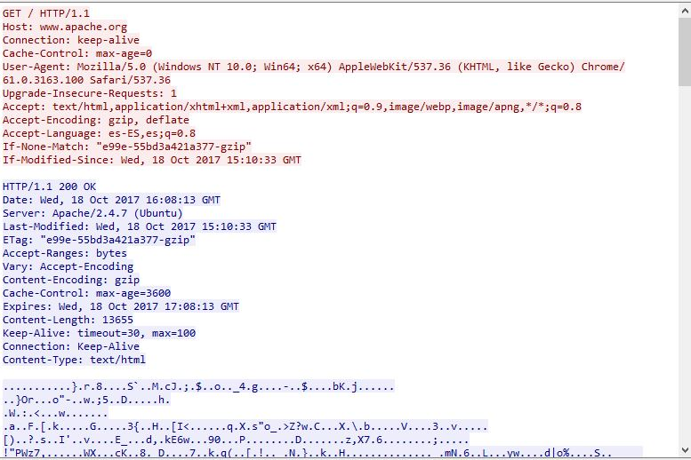
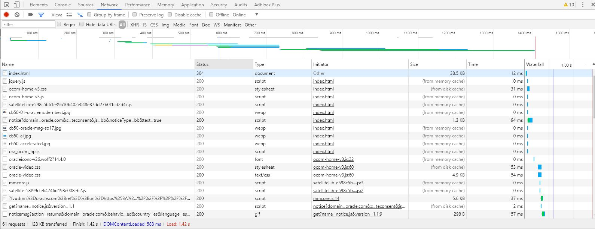
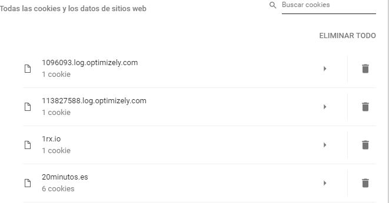
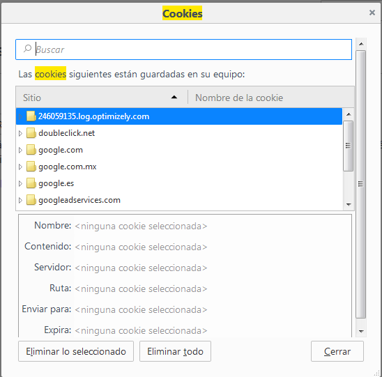

###### *Desarrollo Web en Entorno Servidor - Curso 2017/2018 - IES Leonardo Da Vinci - Alberto Ruiz*
## U1A02 - Protocolo HTTP
#### Entrega de: *Pedro Plaza Ramos*
----
#### 1. Descripción:

Vamos a estudiar el protocolo HTTP utilizando un analizador de trafico.

#### 2. Formato de entrega:

Este mismo documento, incluyendo capturas en cada paso (puedes saltarte alguno si lo consideras irrelevante) y respuestas a las preguntas que se plantean (responde **en negrita**).

#### 3. Trabajo a realizar:

1. Instala el analizador de trafico Wireshark [desde su página web](https://www.wireshark.org/)

    
2. Instala si no lo has hecho ya [el navegador Chrome](https://www.google.com/chrome/browser/desktop/index.html)
3. Inicia una captura con Wireshark.
    * Si es la primera vez que lo usas, tendrás que escoger la interfaz de red por la que quieres escuchar (*Capture > Options*).
    * Si ya has capturado antes, basta con seleccionar *Capture > Start*
    
4. Desde el navegador Google Chrome establece una conexión a [http://www.apache.org](http://www.apache.org)
5. Detén la captura con el boton rojo o *Capture > Stop*
6. Busca una trama HTTP en donde la petición sea GET / HTTP/1.1. Puedes ayudarte del filtro *HTTP*

7. Pulsa sobre ella con el botón secundario del ratón y selecciona *Follow TCP Stream*

8. Responde a las siguientes preguntas:
    1. ¿Qué versión de HTTP se utiliza? HTTP 1.1
    2. ¿Qué método de petición se utiliza? GET
    3. ¿Qué recurso se solicita al servidor? /
    4. ¿Qué valor tiene la cabecera Host? www.apache.org
    5. ¿Se envían cookies en la petición HTTP? No
    6. ¿Que lenguaje utiliza el navegador? Español
    7. ¿Qué código de estado tiene la respuesta HTTP? 200
    8. ¿Qué servidor Web y versión se utiliza? Apache 2.4.7
    9. ¿De qué tipo MIME es el recurso recibido? text/html
    10. ¿Se han utilizado conexiones persistentes, es decir, en la misma conexión TCP hay varias peticiones y respuestas HTTP? Connection: Keep-Alive
    11. ¿Existen peticiones y respuestas de imágenes? Si
9. Accede a las opciones de configuración de Google Chrome (*desplegable con tres puntos en la parte superior derecha > Más herramientas > Herramientas para desarrolladores*. Escoge la pestaña *Network*
10. Accede a [www.oracle.com](www.oracle.com) y observa lo que aparece en la ventana de desarrollador
11. Analiza la peticiones y respuestas HTTP: métodos, códigos de respuesta, recursos que envía el servidor, etc.

12. ¿Puedes encontrar las cookies entre las opciones que ofrecen las herramientas de desarrolladores?
13. Accede a las opciones de configuración de Google Chrome y busca *Cookies* en el campo *Buscar ajustes*. Localiza todas las cookies que tiene almacenadas el navegador.

14. Localiza en Firefox cómo acceder a las herramientas de desarrolladores y repite la captura de acceso a un sitio web.
15. ¿Puedes localizar tambien las cookies?

